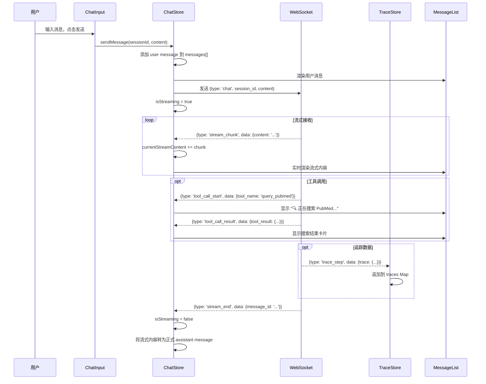
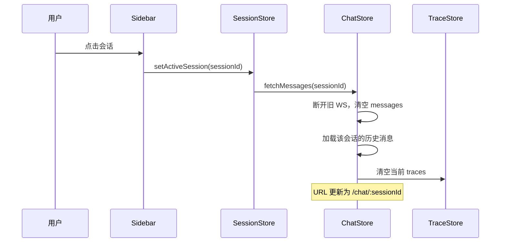

# AIDD Agent Platform — 前端设计文档

> 本文档是 [AIDD Agent Platform 产品设计文档](./AIDD_Agent_Platform产品设计文档.md) 的前端细化版本。

---

## 1. 技术栈总览

| 类别 | 技术 | 版本 | 说明 |
|------|------|------|------|
| 构建工具 | **Vite** | 6.x | 极速 HMR，原生 ESM |
| UI 框架 | **React** | 19.x | Concurrent Mode + Server Components 支持 |
| 语言 | **TypeScript** | 5.x | 类型安全 |
| UI 组件库 | **Shadcn/ui** | latest | 基于 Radix UI，高度可定制 |
| 样式 | **Tailwind CSS** | 4.x | Shadcn/ui 依赖，原子化 CSS |
| 状态管理 | **Zustand** | 5.x | 轻量，适合实时对话场景 |
| 路由 | **React Router** | 7.x | SPA 路由 |
| 实时通信 | **WebSocket** (原生) | — | Agent 流式输出 |
| HTTP 客户端 | **ky** 或 **axios** | — | REST API 调用 |
| Markdown 渲染 | **react-markdown** + **rehype-highlight** | — | Agent 输出渲染 |
| 代码高亮 | **Shiki** | — | 代码块语法高亮 |
| 图标 | **Lucide React** | — | Shadcn/ui 默认图标集 |

### 测试工具链

| 工具 | 用途 |
|------|------|
| **Storybook** 8.x | 组件开发、隔离测试、视觉文档 |
| **Vitest** | 单元测试 + React Testing Library |
| **Playwright** | E2E 端到端测试 |
| **MSW** (Mock Service Worker) | 拦截 API 请求，前后端独立开发 |

---

## 2. 页面结构与路由

```
/login                → 登录页
/register             → 注册页
/chat                 → 主对话页 (默认路由，需登录)
/chat/:sessionId      → 指定会话对话页
```

### 页面布局

```
┌─────────────────────────────────────────────────────┐
│                    顶部导航栏                         │
│  [Logo] AIDD Agent        [用户名] [退出]            │
├────────────┬────────────────────────┬────────────────┤
│            │                        │                │
│  会话侧边栏  │     主对话区域           │  Agent 追踪   │
│            │                        │  面板 (可折叠)  │
│  [+新会话]  │  ┌──────────────────┐  │                │
│            │  │ 消息气泡          │  │  Step 1: 🤔    │
│  会话1      │  │ ...              │  │  Step 2: 🔧    │
│  会话2 ●    │  │                  │  │  Step 3: 📝    │
│  会话3      │  └──────────────────┘  │                │
│            │                        │                │
│            │  ┌──────────────────┐  │                │
│            │  │ 输入框    [发送]   │  │                │
│            │  └──────────────────┘  │                │
└────────────┴────────────────────────┴────────────────┘
```

---

## 3. 组件树设计

```
App
├── AuthProvider (JWT context)
├── Routes
│   ├── LoginPage
│   ├── RegisterPage
│   └── ChatLayout (需要登录)
│       ├── Sidebar
│       │   ├── NewChatButton
│       │   ├── SessionList
│       │   │   └── SessionItem (title, time, active state)
│       │   └── UserMenu (username, logout)
│       ├── ChatArea
│       │   ├── MessageList
│       │   │   ├── UserMessage
│       │   │   ├── AssistantMessage
│       │   │   │   ├── MarkdownRenderer
│       │   │   │   ├── CodeBlock (with Shiki)
│       │   │   │   ├── SearchResultCard (领域搜索结果卡片)
│       │   │   │   └── CitationList (引用列表)
│       │   │   └── ToolCallMessage (工具调用状态)
│       │   ├── StreamingIndicator (打字动画)
│       │   └── ScrollToBottom
│       ├── ChatInput
│       │   ├── TextArea (自适应高度)
│       │   ├── SendButton
│       │   └── StopButton (终止生成)
│       └── TracePanel (右侧可折叠)
│           ├── TracePanelToggle
│           ├── TraceStepList
│           │   └── TraceStep
│           │       ├── StepHeader (类型图标 + 耗时)
│           │       ├── PromptViewer (可展开)
│           │       ├── ResponseViewer (可展开)
│           │       ├── ToolCallDetail (参数 + 返回值)
│           │       └── TokenCostBadge
│           └── TraceSummary (总 token/cost/latency)
```

---

## 4. 状态管理 (Zustand Stores)

### 4.1 AuthStore

```typescript
interface AuthStore {
  // State
  user: User | null;
  token: string | null;
  isAuthenticated: boolean;

  // Actions
  login: (username: string, password: string) => Promise<void>;
  register: (username: string, password: string) => Promise<void>;
  logout: () => void;
  loadFromStorage: () => void;  // 从 localStorage 恢复
}

interface User {
  id: string;
  username: string;
  created_at: string;
}
```

### 4.2 SessionStore

```typescript
interface SessionStore {
  // State
  sessions: Session[];
  activeSessionId: string | null;
  isLoading: boolean;

  // Actions
  fetchSessions: () => Promise<void>;
  createSession: (title?: string) => Promise<Session>;
  deleteSession: (id: string) => Promise<void>;
  renameSession: (id: string, title: string) => Promise<void>;
  setActiveSession: (id: string) => void;
}

interface Session {
  id: string;
  title: string;
  created_at: string;
  updated_at: string;
  message_count?: number;
}
```

### 4.3 ChatStore

```typescript
interface ChatStore {
  // State
  messages: Message[];
  isStreaming: boolean;
  currentStreamContent: string;

  // Actions
  fetchMessages: (sessionId: string) => Promise<void>;
  sendMessage: (sessionId: string, content: string) => void;
  stopStreaming: () => void;

  // WebSocket 内部管理
  _ws: WebSocket | null;
  _connectWs: (sessionId: string) => void;
  _disconnectWs: () => void;
}

interface Message {
  id: string;
  role: 'user' | 'assistant' | 'system' | 'tool';
  content: string;
  metadata?: Record<string, unknown>;
  token_count?: number;
  created_at: string;
  traces?: AgentTrace[];  // 关联的追踪数据
}
```

### 4.4 TraceStore

```typescript
interface TraceStore {
  // State
  traces: Map<string, AgentTrace[]>;  // messageId -> traces
  expandedSteps: Set<string>;         // 展开的步骤 ID
  isPanelOpen: boolean;

  // Actions
  fetchTraces: (messageId: string) => Promise<void>;
  toggleStep: (traceId: string) => void;
  togglePanel: () => void;
}

interface AgentTrace {
  id: string;
  message_id: string;
  step_number: number;
  step_type: 'think' | 'act' | 'observe' | 'summarize';
  prompt_sent?: string;
  llm_response?: string;
  tool_call?: {
    name: string;
    arguments: Record<string, unknown>;
  };
  tool_result?: unknown;
  input_tokens: number;
  output_tokens: number;
  latency_ms: number;
  cost_usd: number;
  created_at: string;
}
```

---

## 5. API 通信层

### 5.1 REST API 客户端

```typescript
// services/api.ts
const API_BASE = import.meta.env.VITE_API_BASE_URL || 'http://localhost:8000/api/v1';

class ApiClient {
  private token: string | null = null;

  setToken(token: string) { this.token = token; }

  private headers(): HeadersInit {
    const h: HeadersInit = { 'Content-Type': 'application/json' };
    if (this.token) h['Authorization'] = `Bearer ${this.token}`;
    return h;
  }

  // Auth
  async login(username: string, password: string): Promise<LoginResponse>;
  async register(username: string, password: string): Promise<LoginResponse>;

  // Sessions
  async getSessions(): Promise<Session[]>;
  async createSession(title?: string): Promise<Session>;
  async deleteSession(id: string): Promise<void>;
  async renameSession(id: string, title: string): Promise<Session>;

  // Messages
  async getMessages(sessionId: string): Promise<Message[]>;

  // Traces
  async getTraces(messageId: string): Promise<AgentTrace[]>;
}
```

### 5.2 WebSocket 协议

```typescript
// 连接地址
ws://localhost:8000/api/v1/chat/stream?token={jwt_token}

// 客户端 → 服务端
interface WsClientMessage {
  type: 'chat';
  session_id: string;
  content: string;
}

// 服务端 → 客户端 (流式推送)
interface WsServerMessage {
  type: 'stream_start'      // 开始生成
      | 'stream_chunk'      // 文本片段
      | 'stream_end'        // 生成结束
      | 'tool_call_start'   // 开始工具调用
      | 'tool_call_result'  // 工具调用结果
      | 'trace_step'        // 追踪步骤 (实时)
      | 'error';            // 错误
  data: {
    content?: string;        // stream_chunk 时的文本片段
    message_id?: string;     // stream_end 时的完整消息 ID
    trace?: AgentTrace;      // trace_step 时的追踪数据
    tool_name?: string;      // tool_call_start 时的工具名
    tool_result?: unknown;   // tool_call_result 时的返回值
    error?: string;          // error 时的错误信息
  };
}
```

---

## 6. 关键交互流程

### 6.1 发送消息流程



### 6.2 会话切换流程



---

## 7. UI 组件详细设计

### 7.1 AssistantMessage 组件

Agent 的回复消息需要支持富文本渲染：

| 内容类型 | 渲染方式 |
|----------|----------|
| 普通文本 | react-markdown |
| 代码块 | Shiki 高亮 + 复制按钮 |
| 搜索结果 | SearchResultCard（标题、摘要、来源、链接） |
| 表格 | Markdown table → HTML table |
| 引用 | 角标 [1][2] + 底部引用列表 |
| 工具调用状态 | 内联提示条 "🔍 Searching PubMed..." |
| LaTeX 公式 | KaTeX 渲染（化学/药物结构式） |

### 7.2 SearchResultCard 组件

```
┌──────────────────────────────────────┐
│ 📄 PubMed                           │
│                                      │
│ **EGFR inhibitors in NSCLC: A ...**  │
│ Authors: Zhang et al. (2025)         │
│ Journal: Nature Medicine             │
│                                      │
│ 摘要: This study demonstrates...     │
│                                      │
│ [查看原文 ↗]          PMID: 12345678 │
└──────────────────────────────────────┘
```

### 7.3 TraceStep 组件

```
┌──────────────────────────────────────┐
│ ▶ Step 2: 🔧 Tool Call   245ms  $0.002│
├──────────────────────────────────────┤
│ Tool: query_pubmed                    │
│ Arguments:                            │
│   query: "EGFR inhibitor 2025"       │
│   max_papers: 5                       │
│                                      │
│ ▼ Prompt Sent (展开/折叠)             │
│ ┌─────────────────────────────────┐  │
│ │ You are a biomedical research...│  │
│ └─────────────────────────────────┘  │
│                                      │
│ ▼ Result (展开/折叠)                  │
│ ┌─────────────────────────────────┐  │
│ │ { "total": 5, "papers": [...] } │  │
│ └─────────────────────────────────┘  │
│                                      │
│ Tokens: 1,234 in / 567 out           │
└──────────────────────────────────────┘
```

---

## 8. 目录结构

```
frontend/
├── public/
│   └── favicon.svg
├── src/
│   ├── components/
│   │   ├── auth/
│   │   │   ├── LoginForm.tsx
│   │   │   ├── RegisterForm.tsx
│   │   │   └── AuthGuard.tsx          # 路由守卫
│   │   ├── chat/
│   │   │   ├── ChatArea.tsx
│   │   │   ├── ChatInput.tsx
│   │   │   ├── MessageList.tsx
│   │   │   ├── UserMessage.tsx
│   │   │   ├── AssistantMessage.tsx
│   │   │   ├── ToolCallMessage.tsx
│   │   │   ├── StreamingIndicator.tsx
│   │   │   └── MarkdownRenderer.tsx
│   │   ├── sidebar/
│   │   │   ├── Sidebar.tsx
│   │   │   ├── SessionList.tsx
│   │   │   ├── SessionItem.tsx
│   │   │   ├── NewChatButton.tsx
│   │   │   └── UserMenu.tsx
│   │   ├── trace/
│   │   │   ├── TracePanel.tsx
│   │   │   ├── TraceStepList.tsx
│   │   │   ├── TraceStep.tsx
│   │   │   ├── PromptViewer.tsx
│   │   │   ├── TokenCostBadge.tsx
│   │   │   └── TraceSummary.tsx
│   │   ├── search/
│   │   │   ├── SearchResultCard.tsx
│   │   │   └── CitationList.tsx
│   │   ├── ui/                        # Shadcn/ui 组件
│   │   │   ├── button.tsx
│   │   │   ├── input.tsx
│   │   │   ├── dialog.tsx
│   │   │   ├── sheet.tsx             # 侧边面板
│   │   │   ├── scroll-area.tsx
│   │   │   └── ...
│   │   └── layout/
│   │       ├── ChatLayout.tsx
│   │       ├── Header.tsx
│   │       └── ResizablePanel.tsx
│   ├── hooks/
│   │   ├── useWebSocket.ts           # WebSocket 连接管理
│   │   ├── useAutoScroll.ts          # 自动滚动到底部
│   │   ├── useAutoResize.ts          # TextArea 自适应高度
│   │   └── useDebounce.ts
│   ├── stores/
│   │   ├── authStore.ts
│   │   ├── sessionStore.ts
│   │   ├── chatStore.ts
│   │   └── traceStore.ts
│   ├── services/
│   │   ├── api.ts                    # REST API 客户端
│   │   └── ws.ts                     # WebSocket 封装
│   ├── types/
│   │   ├── api.ts                    # API 请求/响应类型
│   │   ├── chat.ts                   # 对话相关类型
│   │   └── trace.ts                  # 追踪相关类型
│   ├── lib/
│   │   └── utils.ts                  # Shadcn/ui 工具函数
│   ├── App.tsx
│   ├── main.tsx
│   └── index.css                     # Tailwind 入口
├── .storybook/
│   ├── main.ts
│   └── preview.ts
├── e2e/
│   ├── auth.spec.ts
│   ├── chat.spec.ts
│   └── trace.spec.ts
├── vite.config.ts
├── tailwind.config.ts
├── tsconfig.json
├── playwright.config.ts
└── package.json
```

---

## 9. 设计规范

### 9.1 色彩方案 (Dark Mode 优先)

| 用途 | CSS Variable | 色值示例 |
|------|-------------|---------|
| 背景 (主区域) | `--background` | `hsl(224, 20%, 8%)` |
| 背景 (侧边栏) | `--sidebar-bg` | `hsl(224, 20%, 6%)` |
| 前景文字 | `--foreground` | `hsl(0, 0%, 92%)` |
| 主色调 | `--primary` | `hsl(217, 91%, 60%)` |
| 用户消息气泡 | `--user-bubble` | `hsl(217, 91%, 55%)` |
| Agent 消息气泡 | `--assistant-bubble` | `hsl(224, 15%, 14%)` |
| 边框 | `--border` | `hsl(224, 15%, 18%)` |
| 搜索结果卡片 | `--card` | `hsl(224, 15%, 12%)` |
| 追踪面板 | `--trace-bg` | `hsl(224, 20%, 10%)` |

### 9.2 追踪步骤类型图标

| step_type | 图标 | 颜色 |
|-----------|------|------|
| `think` | 🤔 | `hsl(45, 93%, 47%)` 黄色 |
| `act` | 🔧 | `hsl(217, 91%, 60%)` 蓝色 |
| `observe` | 👁️ | `hsl(142, 71%, 45%)` 绿色 |
| `summarize` | 📝 | `hsl(280, 65%, 60%)` 紫色 |

### 9.3 响应式断点

| 断点 | 宽度 | 布局 |
|------|------|------|
| Mobile | < 768px | 侧边栏隐藏，追踪面板底部抽屉 |
| Tablet | 768-1024px | 侧边栏可折叠，追踪面板侧滑 |
| Desktop | > 1024px | 三栏布局，追踪面板常驻右侧 |

---

## 10. 性能优化策略

| 策略 | 实现 |
|------|------|
| **虚拟列表** | 长对话使用 `react-virtuoso` 避免 DOM 节点过多 |
| **消息懒加载** | 滚动到顶部时分页加载历史消息 |
| **Markdown 缓存** | 使用 `useMemo` 缓存已渲染的 Markdown |
| **WebSocket 重连** | 自动重连 + 指数退避 (1s, 2s, 4s, 8s, max 30s) |
| **代码分割** | `React.lazy` 加载 TracePanel、Storybook 等非首屏组件 |
| **字体优化** | Google Fonts `display=swap` + `preconnect` |

---

## 11. Storybook 组件开发计划

按开发优先级排序：

| 优先级 | 组件 | Story 覆盖场景 |
|:---:|------|--------------|
| P0 | `ChatInput` | 空状态、输入中、发送中、禁用 |
| P0 | `UserMessage` | 短消息、长消息、代码 |
| P0 | `AssistantMessage` | 纯文本、Markdown、代码块、搜索结果、流式 |
| P0 | `SessionItem` | 默认、激活、hover |
| P1 | `SearchResultCard` | PubMed、UniProt、Scholar 等不同数据源 |
| P1 | `TraceStep` | think/act/observe/summarize 各类型 |
| P1 | `LoginForm` | 默认、加载中、错误 |
| P2 | `TokenCostBadge` | 低/中/高 cost |
| P2 | `StreamingIndicator` | 动画展示 |
