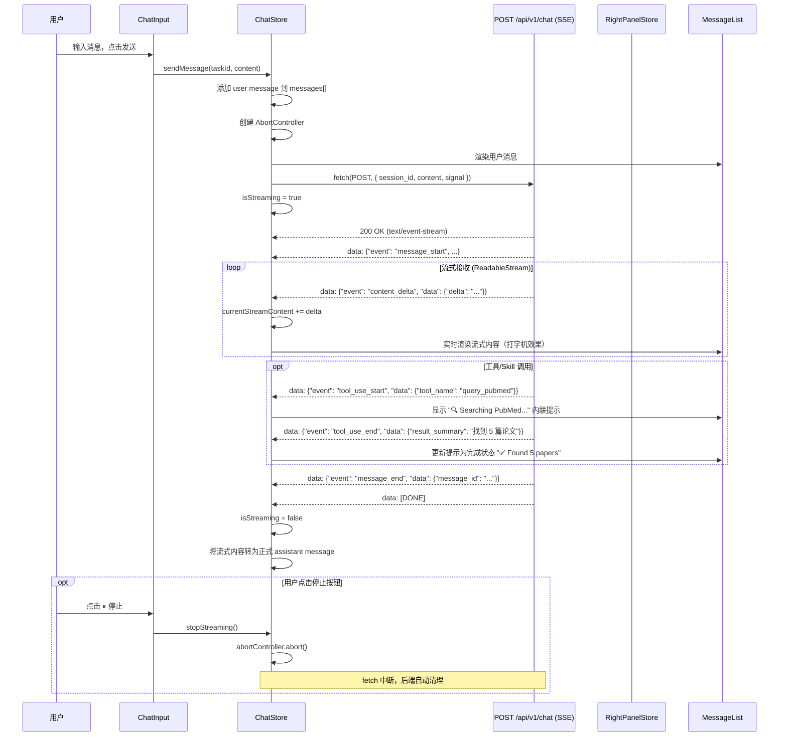
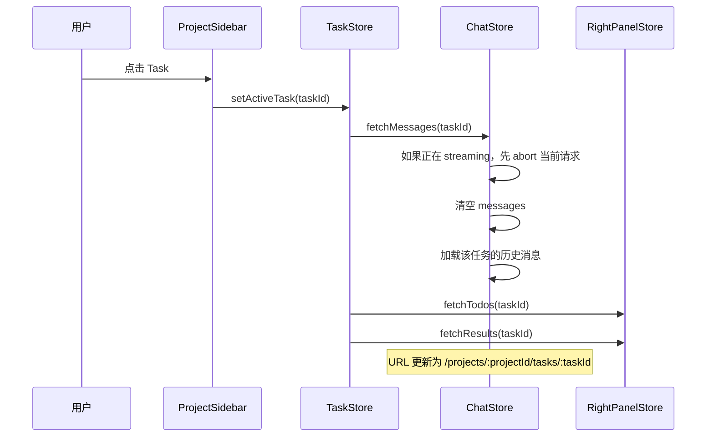
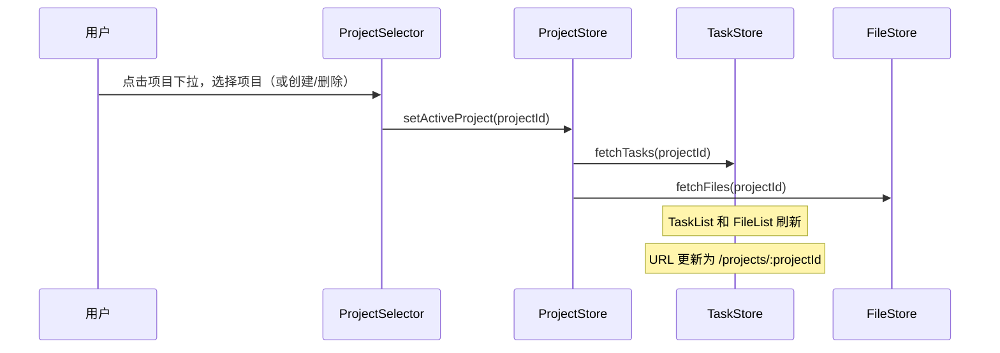

# AIDD Agent Platform — 前端设计文档

> 本文档是 [AIDD Agent Platform 产品设计文档](./AIDD_Agent_Platform产品设计文档.md) 的前端细化版本。

---

## 1. 技术栈总览

| 类别 | 技术 | 版本 | 说明 |
|------|------|------|------|
| 构建工具 | **Vite** | 6.x | 极速 HMR，原生 ESM |
| UI 框架 | **React** | 19.x | Concurrent Mode + Server Components 支持 |
| 语言 | **TypeScript** | 5.x | 类型安全 |
| UI 组件库 | **Shadcn/ui** | latest | 基于 Radix UI，高度可定制 |
| 样式 | **Tailwind CSS** | 4.x | Shadcn/ui 依赖，原子化 CSS |
| 状态管理 | **Zustand** | 5.x | 轻量，适合实时对话场景 |
| 路由 | **React Router** | 7.x | SPA 路由 |
| 实时通信 | **WebSocket** (原生) | — | Agent 流式输出 |
| HTTP 客户端 | **ky** 或 **axios** | — | REST API 调用 |
| Markdown 渲染 | **react-markdown** + **rehype-highlight** | — | Agent 输出渲染 |
| 代码高亮 | **Shiki** | — | 代码块语法高亮 |
| 图标 | **Lucide React** | — | Shadcn/ui 默认图标集 |

### 测试工具链

| 工具 | 用途 |
|------|------|
| **Storybook** 8.x | 组件开发、隔离测试、视觉文档 |
| **Vitest** | 单元测试 + React Testing Library |
| **Playwright** | E2E 端到端测试 |
| **MSW** (Mock Service Worker) | 拦截 API 请求，前后端独立开发 |

---

## 2. 页面结构与路由

```
/login                      → 登录页
/register                   → 注册页
/                           → 重定向到 /projects
/projects                   → 项目列表页 (需登录)
/projects/:projectId        → 项目主页 (默认展示第一个 Task)
/projects/:projectId/tasks/:taskId  → 指定任务对话页
```

### 页面布局

整体采用**四栏布局**：最左侧图标导航栏 + 项目侧边栏 + 主内容区域 + 右侧面板。

```
┌──────┬───────────────────┬──────────────────────────────────┬─────────────────┐
│      │                   │                                  │                 │
│ 图标  │   项目侧边栏        │         主内容区域                │   右侧面板        │
│ 导航  │  (随 Project 切换) │                                  │                 │
│  栏  │                   │  [任务/会话标题]  [Share] [Layout] │  ▼ To-dos       │
│      │  PROJECT          │                                  │                 │
│      │  Quick Tasks ▾ ⚙ □│  ┌──────────────────────────┐   │  (待办事项列表)   │
│  📁  │                   │  │                          │   │                 │
│      │  ▼ Tasks  🔍  + ⊞ │  │  对话 / 内容区域           │   │  ▼ Results      │
│  📦  │  ┌─────────────┐  │  │                          │   │                 │
│      │  │ Task Item ● │  │  │  (消息气泡、Markdown、     │   │  (Agent 产出的   │
│  🔗  │  └─────────────┘  │  │   搜索结果卡片等)          │   │   文件 / 报告)   │
│      │                   │  │                          │   │                 │
│      │  ▼ Files   📤  + ⊞│  └──────────────────────────┘   │                 │
│      │  (No files yet)   │                                  │                 │
│      │                   │  ┌──────────────────────────┐   │                 │
│  ❓  │                   │  │ Message input...    ⏸    │   │                 │
│      │                   │  │ 📎  @  +  Plan mode ○   │   │                 │
│ [SZ] │                   │  └──────────────────────────┘   │                 │
└──────┴───────────────────┴──────────────────────────────────┴─────────────────┘
```

#### 各区域说明

| 区域 | 宽度 | 说明 |
|------|------|------|
| **图标导航栏** | ~48px 固定 | 竖排图标：Projects / Resources / Hub；底部：Help、用户头像 |
| **项目侧边栏** | ~240px 可折叠 | 显示当前 Project 名称（可下拉创建/切换/删除）；下方分两个可折叠区块：**Tasks**（任务列表）和 **Files**（文件列表），均随当前 Project 切换 |
| **主内容区域** | 自适应（flex-1） | 顶部标题栏 + Share/Layout 按钮；中部对话/内容区（消息流）；底部输入框（含附件、@、Plan mode 开关、停止按钮） |
| **右侧面板** | ~280px 可折叠 | **To-dos**（当前任务待办）+ **Results**（Agent 产出的文件/报告，可下载） |

---

## 3. 组件树设计

```
App
├── AuthProvider (JWT context)
├── Routes
│   ├── LoginPage
│   ├── RegisterPage
│   └── AppLayout (需要登录，四栏布局)
│       ├── IconNav (最左侧图标导航栏，固定宽度)
│       │   ├── NavIcon: Projects (图标 + 跳转)
│       │   ├── NavIcon: Resources
│       │   ├── NavIcon: Hub
│       │   ├── NavIcon: Help
│       │   └── UserAvatar (用户头像 + 退出菜单)
│       ├── ProjectSidebar (项目侧边栏，随 Project 切换)
│       │   ├── ProjectSelector (下拉：创建/切换/删除项目)
│       │   ├── TasksSection (可折叠)
│       │   │   ├── SectionHeader (标题 + 搜索 + 新建 + 视图切换)
│       │   │   └── TaskList
│       │   │       └── TaskItem (title, status, active state)
│       │   └── FilesSection (可折叠，原 Drive)
│       │       ├── SectionHeader (标题 + 上传 + 新建)
│       │       └── FileList
│       │           └── FileItem (name, type, size)
│       ├── MainContent (主内容区域，flex-1)
│       │   ├── ContentHeader (任务标题 + Share + Layout 按钮)
│       │   ├── MessageList
│       │   │   ├── UserMessage
│       │   │   ├── AssistantMessage
│       │   │   │   ├── MarkdownRenderer
│       │   │   │   ├── CodeBlock (with Shiki)
│       │   │   │   ├── SearchResultCard (领域搜索结果卡片)
│       │   │   │   └── CitationList (引用列表)
│       │   │   ├── ToolCallMessage (工具调用状态，如 "Loading skill...")
│       │   │   └── ExecutingIndicator (执行中动画)
│       │   ├── ScrollToBottom
│       │   └── ChatInput
│       │       ├── TextArea (自适应高度，placeholder: "Message anytime...")
│       │       ├── AttachButton (📎)
│       │       ├── MentionButton (@)
│       │       ├── AddButton (+)
│       │       ├── PlanModeToggle (Plan mode 开关)
│       │       └── StopButton (⏸ 终止生成)
│       └── RightPanel (右侧面板，可折叠)
│           ├── TodosSection (可折叠)
│           │   ├── SectionHeader
│           │   └── TodoList (待办事项，无内容时显示空态)
│           └── ResultsSection (可折叠)
│               ├── SectionHeader (+ 刷新按钮)
│               └── ResultFileList (Agent 产出文件，无内容时显示空态)
```

---

## 4. 状态管理 (Zustand Stores)

### 4.1 AuthStore

```typescript
interface AuthStore {
  // State
  user: User | null;
  token: string | null;
  isAuthenticated: boolean;

  // Actions
  login: (username: string, password: string) => Promise<void>;
  register: (username: string, password: string) => Promise<void>;
  logout: () => void;
  loadFromStorage: () => void;  // 从 localStorage 恢复
}

interface User {
  id: string;
  username: string;
  created_at: string;
}
```

### 4.2 ProjectStore

```typescript
interface ProjectStore {
  // State
  projects: Project[];
  activeProjectId: string | null;
  isLoading: boolean;

  // Actions
  fetchProjects: () => Promise<void>;
  createProject: (name: string) => Promise<Project>;
  deleteProject: (id: string) => Promise<void>;
  renameProject: (id: string, name: string) => Promise<void>;
  setActiveProject: (id: string) => void;
}

interface Project {
  id: string;
  name: string;
  created_at: string;
  updated_at: string;
}
```

### 4.3 TaskStore

```typescript
interface TaskStore {
  // State
  tasks: Task[];                  // 当前 project 下的任务列表
  activeTaskId: string | null;
  isLoading: boolean;

  // Actions
  fetchTasks: (projectId: string) => Promise<void>;
  createTask: (projectId: string, title?: string) => Promise<Task>;
  deleteTask: (id: string) => Promise<void>;
  renameTask: (id: string, title: string) => Promise<void>;
  setActiveTask: (id: string) => void;
}

interface Task {
  id: string;
  project_id: string;
  title: string;
  status: 'pending' | 'running' | 'completed' | 'failed';
  created_at: string;
  updated_at: string;
  message_count?: number;
}
```

### 4.4 FileStore

```typescript
interface FileStore {
  // State
  files: ProjectFile[];           // 当前 project 下的文件列表
  isLoading: boolean;

  // Actions
  fetchFiles: (projectId: string) => Promise<void>;
  uploadFile: (projectId: string, file: File) => Promise<ProjectFile>;
  deleteFile: (id: string) => Promise<void>;
}

interface ProjectFile {
  id: string;
  project_id: string;
  name: string;
  size: number;
  mime_type: string;
  url: string;
  created_at: string;
}
```

### 4.5 ChatStore

```typescript
interface ChatStore {
  // State
  messages: Message[];
  isStreaming: boolean;
  currentStreamContent: string;
  currentThinkingContent: string;
  isPlanMode: boolean;
  activeToolCalls: ToolCallStatus[];  // 当前进行中的工具调用

  // Actions
  fetchMessages: (taskId: string) => Promise<void>;
  sendMessage: (taskId: string, content: string) => void;
  stopStreaming: () => void;   // 通过 AbortController.abort() 实现
  togglePlanMode: () => void;

  // SSE 内部管理 (替代旧的 WebSocket)
  _abortController: AbortController | null;
}

interface Message {
  id: string;
  role: 'user' | 'assistant' | 'system' | 'tool';
  content: string;
  thinkingContent?: string;    // <thought> 标签内容（折叠显示）
  toolCalls?: ToolCallStatus[];
  metadata?: Record<string, unknown>;
  token_count?: number;
  created_at: string;
}

interface ToolCallStatus {
  tool_call_id: string;
  tool_name: string;
  status: 'running' | 'completed';
  result_summary?: string;
}
```

### 4.6 RightPanelStore

```typescript
interface RightPanelStore {
  // State
  todos: Todo[];
  results: ResultFile[];
  isTodosOpen: boolean;
  isResultsOpen: boolean;

  // Actions
  fetchTodos: (taskId: string) => Promise<void>;
  fetchResults: (taskId: string) => Promise<void>;
  toggleTodos: () => void;
  toggleResults: () => void;
  refreshResults: () => void;
}

interface Todo {
  id: string;
  task_id: string;
  content: string;
  is_done: boolean;
  created_at: string;
}

interface ResultFile {
  id: string;
  task_id: string;
  name: string;
  url: string;
  mime_type: string;
  created_at: string;
}
```

---

## 5. API 通信层

### 5.1 REST API 客户端

```typescript
// services/api.ts
const API_BASE = import.meta.env.VITE_API_BASE_URL || 'http://localhost:8000/api/v1';

class ApiClient {
  private token: string | null = null;

  setToken(token: string) { this.token = token; }

  private headers(): HeadersInit {
    const h: HeadersInit = { 'Content-Type': 'application/json' };
    if (this.token) h['Authorization'] = `Bearer ${this.token}`;
    return h;
  }

  // Auth
  async login(username: string, password: string): Promise<LoginResponse>;
  async register(username: string, password: string): Promise<LoginResponse>;

  // Projects
  async getProjects(): Promise<Project[]>;
  async createProject(name: string): Promise<Project>;
  async deleteProject(id: string): Promise<void>;
  async renameProject(id: string, name: string): Promise<Project>;

  // Tasks (per project)
  async getTasks(projectId: string): Promise<Task[]>;
  async createTask(projectId: string, title?: string): Promise<Task>;
  async deleteTask(id: string): Promise<void>;
  async renameTask(id: string, title: string): Promise<Task>;

  // Files (per project)
  async getFiles(projectId: string): Promise<ProjectFile[]>;
  async uploadFile(projectId: string, file: File): Promise<ProjectFile>;
  async deleteFile(id: string): Promise<void>;

  // Messages (per task)
  async getMessages(taskId: string): Promise<Message[]>;

  // Right panel
  async getTodos(taskId: string): Promise<Todo[]>;
  async getResults(taskId: string): Promise<ResultFile[]>;
}
```

### 5.2 流式对话协议 (SSE)

> **协议选型**：采用 SSE（Server-Sent Events）而非 WebSocket，与 ChatGPT、Claude、Gemini 三大主流 AI 产品一致。用户消息通过普通 POST 发送，服务端通过 `text/event-stream` 流式推送 token。

```typescript
// services/chatApi.ts

export interface ChatSSEEvent {
  event: string;
  data: Record<string, any>;
}

/**
 * 发送消息并通过 SSE 接收流式响应。
 * 使用原生 fetch + ReadableStream，无需第三方库。
 */
export async function streamChat(
  sessionId: string,
  content: string,
  options: {
    token: string;
    onDelta: (text: string) => void;         // 打字机效果
    onThinking: (text: string) => void;      // 思考内容（折叠显示）
    onToolStart: (name: string, id: string, args: any) => void;
    onToolEnd: (id: string, summary: string) => void;
    onDone: (messageId: string) => void;
    onError: (error: string) => void;
    signal?: AbortSignal;                    // 停止生成用
  }
) {
  const response = await fetch(`${API_BASE}/chat`, {
    method: 'POST',
    headers: {
      'Authorization': `Bearer ${options.token}`,
      'Content-Type': 'application/json',
    },
    body: JSON.stringify({ session_id: sessionId, content }),
    signal: options.signal,
  });

  if (!response.ok) {
    const err = await response.json();
    options.onError(err.detail || 'Request failed');
    return;
  }

  // 使用 ReadableStream 解析 SSE
  const reader = response.body!.getReader();
  const decoder = new TextDecoder();
  let buffer = '';

  while (true) {
    const { done, value } = await reader.read();
    if (done) break;

    buffer += decoder.decode(value, { stream: true });
    const lines = buffer.split('\n\n');
    buffer = lines.pop()!;  // 保留未完成的部分

    for (const line of lines) {
      if (!line.startsWith('data: ')) continue;
      const payload = line.slice(6).trim();

      if (payload === '[DONE]') return;

      try {
        const event: ChatSSEEvent = JSON.parse(payload);
        switch (event.event) {
          case 'content_delta':   options.onDelta(event.data.delta); break;
          case 'thinking_delta':  options.onThinking(event.data.delta); break;
          case 'tool_use_start':  options.onToolStart(event.data.tool_name, event.data.tool_call_id, event.data.args); break;
          case 'tool_use_end':    options.onToolEnd(event.data.tool_call_id, event.data.result_summary); break;
          case 'message_end':     options.onDone(event.data.message_id); break;
          case 'error':           options.onError(event.data.message); break;
        }
      } catch { /* 忽略解析失败的行 */ }
    }
  }
}
```

#### 停止生成实现

```typescript
// 前端通过 AbortController 中断 fetch 请求即可实现停止生成。
// 后端 StreamingResponse 在客户端断开后自动清理，无需额外接口。
const abortController = new AbortController();

// 发送时绑定 signal
streamChat(sessionId, content, { ..., signal: abortController.signal });

// 用户点击停止按钮
stopButton.onclick = () => abortController.abort();
```

#### SSE 事件类型速查

| 事件 | 说明 | data 字段 |
|------|------|--------|
| `message_start` | 开始生成 | `message_id` |
| `content_delta` | 文本片段 | `delta` |
| `thinking_delta` | 思考内容 | `delta` |
| `tool_use_start` | 工具调用开始 | `tool_name`, `tool_call_id`, `args` |
| `tool_use_end` | 工具调用完成 | `tool_call_id`, `result_summary` |
| `citation` | 引用 | `index`, `url`, `title` |
| `message_end` | 生成结束 | `message_id`, `usage` |
| `error` | 错误 | `code`, `message` |
| `[DONE]` | 流结束 | — |
```

---

## 6. 关键交互流程

### 6.1 发送消息流程 (SSE)



### 6.2 任务切换流程



### 6.3 项目切换流程



---

## 7. UI 组件详细设计

### 7.1 AssistantMessage 组件

Agent 的回复消息需要支持富文本渲染：

| 内容类型 | 渲染方式 |
|----------|----------|
| 普通文本 | react-markdown |
| 代码块 | Shiki 高亮 + 复制按钮 |
| 搜索结果 | SearchResultCard（标题、摘要、来源、链接） |
| 表格 | Markdown table → HTML table |
| 引用 | 角标 [1][2] + 底部引用列表 |
| 工具调用状态 | 内联提示条 "🔍 Searching PubMed..." |
| LaTeX 公式 | KaTeX 渲染（化学/药物结构式） |

### 7.2 SearchResultCard 组件

```
┌──────────────────────────────────────┐
│ 📄 PubMed                           │
│                                      │
│ **EGFR inhibitors in NSCLC: A ...**  │
│ Authors: Zhang et al. (2025)         │
│ Journal: Nature Medicine             │
│                                      │
│ 摘要: This study demonstrates...     │
│                                      │
│ [查看原文 ↗]          PMID: 12345678 │
└──────────────────────────────────────┘
```

### 7.3 TraceStep 组件

```
┌──────────────────────────────────────┐
│ ▶ Step 2: 🔧 Tool Call   245ms  $0.002│
├──────────────────────────────────────┤
│ Tool: query_pubmed                    │
│ Arguments:                            │
│   query: "EGFR inhibitor 2025"       │
│   max_papers: 5                       │
│                                      │
│ ▼ Prompt Sent (展开/折叠)             │
│ ┌─────────────────────────────────┐  │
│ │ You are a biomedical research...│  │
│ └─────────────────────────────────┘  │
│                                      │
│ ▼ Result (展开/折叠)                  │
│ ┌─────────────────────────────────┐  │
│ │ { "total": 5, "papers": [...] } │  │
│ └─────────────────────────────────┘  │
│                                      │
│ Tokens: 1,234 in / 567 out           │
└──────────────────────────────────────┘
```

---

## 8. 目录结构

```
frontend/
├── public/
│   └── favicon.svg
├── src/
│   ├── components/
│   │   ├── auth/
│   │   │   ├── LoginForm.tsx
│   │   │   ├── RegisterForm.tsx
│   │   │   └── AuthGuard.tsx              # 路由守卫
│   │   ├── layout/
│   │   │   ├── AppLayout.tsx              # 四栏布局容器
│   │   │   ├── IconNav.tsx                # 最左侧图标导航栏
│   │   │   └── ResizablePanel.tsx         # 可拖拽调整宽度的面板
│   │   ├── project/
│   │   │   ├── ProjectSelector.tsx        # 项目下拉（创建/切换/删除）
│   │   │   ├── ProjectSidebar.tsx         # 项目侧边栏（Tasks + Files）
│   │   │   ├── TasksSection.tsx           # 可折叠 Tasks 区块
│   │   │   ├── TaskList.tsx
│   │   │   ├── TaskItem.tsx               # title, status, active state
│   │   │   ├── FilesSection.tsx           # 可折叠 Files 区块（原 Drive）
│   │   │   ├── FileList.tsx
│   │   │   └── FileItem.tsx               # name, type, size
│   │   ├── chat/
│   │   │   ├── MainContent.tsx            # 主内容区（含 header + 消息 + 输入）
│   │   │   ├── ContentHeader.tsx          # 任务标题 + Share + Layout 按钮
│   │   │   ├── MessageList.tsx
│   │   │   ├── UserMessage.tsx
│   │   │   ├── AssistantMessage.tsx
│   │   │   ├── ToolCallMessage.tsx        # "Loading skill..." 提示条
│   │   │   ├── ExecutingIndicator.tsx     # "Executing." 动画
│   │   │   ├── ChatInput.tsx              # 输入框 + 工具栏
│   │   │   └── MarkdownRenderer.tsx
│   │   ├── right-panel/
│   │   │   ├── RightPanel.tsx             # 右侧面板容器
│   │   │   ├── TodosSection.tsx           # To-dos 折叠区块
│   │   │   ├── TodoItem.tsx
│   │   │   ├── ResultsSection.tsx         # Results 折叠区块
│   │   │   └── ResultFileItem.tsx
│   │   ├── search/
│   │   │   ├── SearchResultCard.tsx
│   │   │   └── CitationList.tsx
│   │   └── ui/                            # Shadcn/ui 组件
│   │       ├── button.tsx
│   │       ├── input.tsx
│   │       ├── dialog.tsx
│   │       ├── dropdown-menu.tsx          # 项目下拉菜单
│   │       ├── collapsible.tsx            # 可折叠区块
│   │       ├── sheet.tsx                  # 移动端侧边面板
│   │       ├── scroll-area.tsx
│   │       └── ...
│   ├── hooks/
│   │   ├── useWebSocket.ts               # WebSocket 连接管理（含重连）
│   │   ├── useAutoScroll.ts              # 自动滚动到底部
│   │   ├── useAutoResize.ts              # TextArea 自适应高度
│   │   └── useDebounce.ts
│   ├── stores/
│   │   ├── authStore.ts
│   │   ├── projectStore.ts
│   │   ├── taskStore.ts
│   │   ├── fileStore.ts
│   │   ├── chatStore.ts
│   │   └── rightPanelStore.ts
│   ├── services/
│   │   ├── api.ts                        # REST API 客户端
│   │   └── ws.ts                         # WebSocket 封装
│   ├── types/
│   │   ├── api.ts                        # API 请求/响应类型
│   │   ├── project.ts                    # 项目/任务/文件相关类型
│   │   └── chat.ts                       # 对话/消息相关类型
│   ├── lib/
│   │   └── utils.ts                      # Shadcn/ui 工具函数
│   ├── App.tsx
│   ├── main.tsx
│   └── index.css                         # Tailwind 入口
├── .storybook/
│   ├── main.ts
│   └── preview.ts
├── e2e/
│   ├── auth.spec.ts
│   ├── project.spec.ts
│   └── chat.spec.ts
├── vite.config.ts
├── tailwind.config.ts
├── tsconfig.json
├── playwright.config.ts
└── package.json
```

---

## 9. 设计规范

### 9.1 色彩方案 (Dark Mode 优先)

| 用途 | CSS Variable | 色值示例 |
|------|-------------|---------|
| 背景 (主区域) | `--background` | `hsl(224, 20%, 8%)` |
| 背景 (侧边栏) | `--sidebar-bg` | `hsl(224, 20%, 6%)` |
| 前景文字 | `--foreground` | `hsl(0, 0%, 92%)` |
| 主色调 | `--primary` | `hsl(217, 91%, 60%)` |
| 用户消息气泡 | `--user-bubble` | `hsl(217, 91%, 55%)` |
| Agent 消息气泡 | `--assistant-bubble` | `hsl(224, 15%, 14%)` |
| 边框 | `--border` | `hsl(224, 15%, 18%)` |
| 搜索结果卡片 | `--card` | `hsl(224, 15%, 12%)` |
| 右侧面板 | `--right-panel-bg` | `hsl(224, 20%, 10%)` |

### 9.2 响应式断点

| 断点 | 宽度 | 布局 |
|------|------|------|
| Mobile | < 768px | 图标导航 + 项目侧边栏隐藏，右侧面板底部抽屉 |
| Tablet | 768-1024px | 图标导航常驻，项目侧边栏可折叠，右侧面板侧滑 |
| Desktop | > 1024px | 四栏布局全部展开，面板宽度可拖拽调整 |

---

## 10. 性能优化策略

| 策略 | 实现 |
|------|------|
| **虚拟列表** | 长对话使用 `react-virtuoso` 避免 DOM 节点过多 |
| **消息懒加载** | 滚动到顶部时分页加载历史消息 |
| **Markdown 缓存** | 使用 `useMemo` 缓存已渲染的 Markdown |
| **WebSocket 重连** | 自动重连 + 指数退避 (1s, 2s, 4s, 8s, max 30s) |
| **代码分割** | `React.lazy` 加载 TracePanel、Storybook 等非首屏组件 |
| **字体优化** | Google Fonts `display=swap` + `preconnect` |

---

## 11. Storybook 组件开发计划

按开发优先级排序：

| 优先级 | 组件 | Story 覆盖场景 |
|:---:|------|--------------|
| P0 | `ChatInput` | 空状态、输入中、发送中、禁用 |
| P0 | `UserMessage` | 短消息、长消息、代码 |
| P0 | `AssistantMessage` | 纯文本、Markdown、代码块、搜索结果、流式 |
| P0 | `TaskItem` | 默认、激活、hover、各 status |
| P1 | `ProjectSelector` | 默认、下拉展开、创建/删除弹窗 |
| P1 | `SearchResultCard` | PubMed、UniProt、Scholar 等不同数据源 |
| P1 | `TodoItem` | 待完成、已完成 |
| P1 | `ResultFileItem` | PDF、JSON、图片等不同类型 |
| P1 | `LoginForm` | 默认、加载中、错误 |
| P2 | `ToolCallMessage` | Loading skill、执行中、已完成 |
| P2 | `ExecutingIndicator` | 动画展示 |
